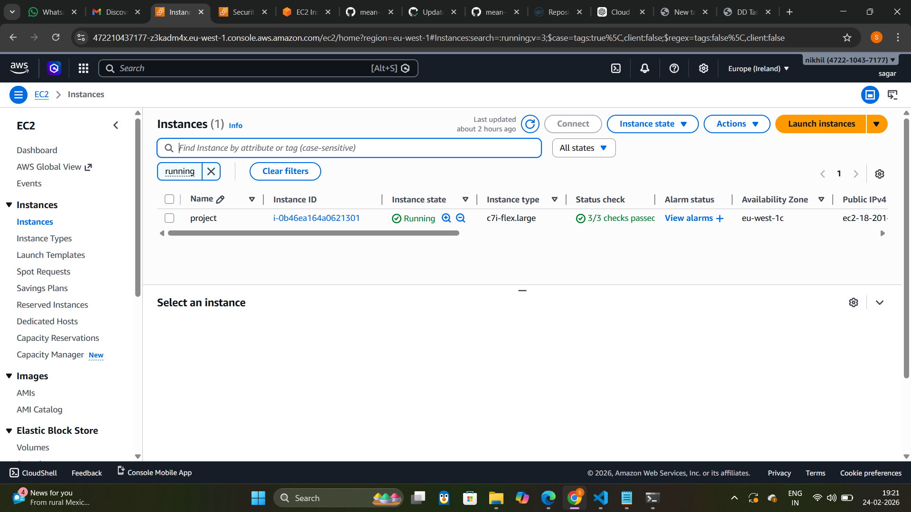
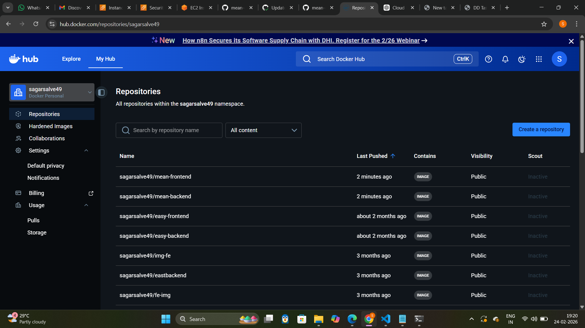
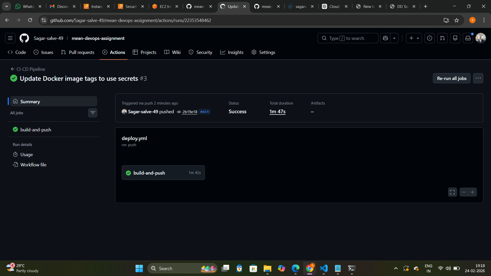
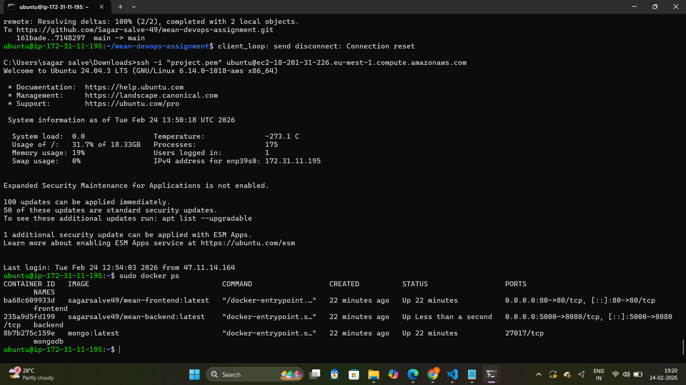
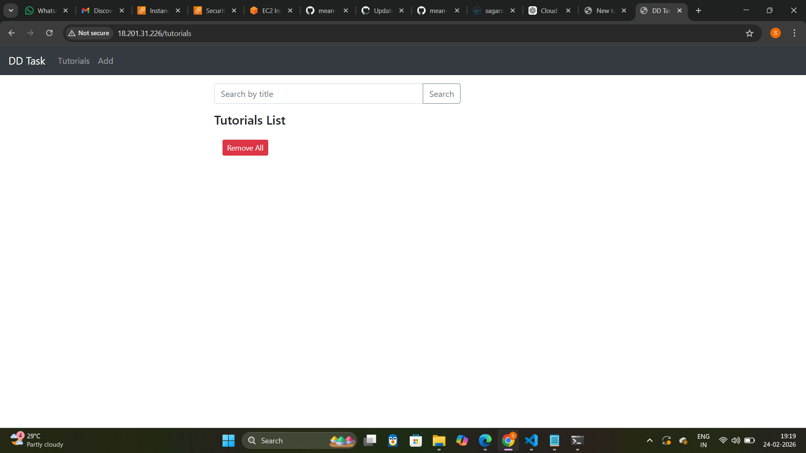

🚀 MEAN Stack DevOps Deployment Assignment
📌 Project Overview

This project demonstrates containerization, CI/CD automation, and cloud deployment of a full-stack MEAN (MongoDB, Express, Angular, Node.js) application.

The application has been:

Dockerized (Frontend & Backend)

Pushed to Docker Hub

Deployed on AWS EC2 using Docker Compose

Automated using GitHub Actions CI/CD pipeline

Exposed via Nginx on Port 80

🏗️ Architecture Diagram (Logical Flow)

GitHub Push
     ↓
GitHub Actions (CI/CD)
     ↓
Build Docker Images
     ↓
Push to Docker Hub
     ↓
EC2 Server (Docker Compose)
     ↓
MongoDB + Backend + Frontend
     ↓
Accessible via Public IP (Port 80)

📂 Project Structure

mean-devops-assignment/
│
├── backend/
│   └── Dockerfile
│
├── frontend/
│   ├── Dockerfile
│   └── nginx-spa.conf
│
├── docker-compose.yml
└── .github/workflows/deploy.yml

🐳 Docker Configuration

Backend Dockerfile

FROM node:18
WORKDIR /app
COPY package*.json ./
RUN npm install
COPY . .
EXPOSE 8080
CMD ["node", "server.js"]

Frontend Dockerfile

FROM node:18 as build
WORKDIR /app
COPY package*.json ./
RUN npm install
COPY . .
RUN npm run build

FROM nginx:latest
COPY --from=build /app/dist/angular-15-crud /usr/share/nginx/html
COPY nginx-spa.conf /etc/nginx/conf.d/default.conf
EXPOSE 80
CMD ["nginx", "-g", "daemon off;"]

🐳 Docker Compose Configuration

version: '3.8'

services:

  mongo:
    image: mongo:latest
    container_name: mongodb
    restart: always
    volumes:
      - mongo-data:/data/db

  backend:
    image: sagarsalve49/mean-backend:latest
    container_name: backend
    restart: always
    ports:
      - "5000:8080"
    environment:
      - MONGO_URI=mongodb://mongo:27017/testdb
    depends_on:
      - mongo

  frontend:
    image: sagarsalve49/mean-frontend:latest
    container_name: frontend
    restart: always
    ports:
      - "80:80"
    depends_on:
      - backend

volumes:
  mongo-data:

  ☁️ Cloud Deployment (AWS EC2)

Instance Type: c7i-flex.large

OS: Ubuntu 24.04 LTS

Docker Installed

Docker Compose Installed

Security Group Opened:

Port 22 (SSH)

Port 80 (HTTP)

port 5000 

EC2 Instance Screenshot

🔄 CI/CD Pipeline (GitHub Actions)

Workflow File: .github/workflows/deploy.yml

name: CI-CD Pipeline

on:
  push:
    branches:
      - main

jobs:
  build-and-push:
    runs-on: ubuntu-latest

    steps:
      - name: Checkout Code
        uses: actions/checkout@v3

      - name: Login to Docker Hub
        run: echo "${{ secrets.DOCKER_PASS }}" | docker login -u "${{ secrets.DOCKER_USER }}" --password-stdin

      - name: Build Backend
        run: docker build -t ${{ secrets.DOCKER_USER }}/mean-backend:latest ./backend

      - name: Build Frontend
        run: docker build -t ${{ secrets.DOCKER_USER }}/mean-frontend:latest ./frontend

      - name: Push Backend
        run: docker push ${{ secrets.DOCKER_USER }}/mean-backend:latest

      - name: Push Frontend
        run: docker push ${{ secrets.DOCKER_USER }}/mean-frontend:latest

🔐 GitHub Secrets Used

DOCKER_USER

DOCKER_PASS (Docker Hub Access Token)

📦 Docker Hub Repositories

sagarsalve49/mean-backend

sagarsalve49/mean-frontend

Docker Hub Screenshot

✅ CI/CD Success Screenshot

🚀 Deployment on EC2

After images are pushed:

docker-compose pull
docker-compose up -d

Verify running containers:

docker ps

Running Containers Screenshot

🌐 Application Access

http://18.201.31.226

Application Screenshot

🔁 End-to-End Automation Flow

Developer pushes code to GitHub

GitHub Actions builds Docker images

Images pushed to Docker Hub

EC2 pulls latest images

Containers restarted automatically

🛠️ Technologies Used

Node.js

Angular

MongoDB

Docker

Docker Compose

GitHub Actions

AWS EC2

Nginx
